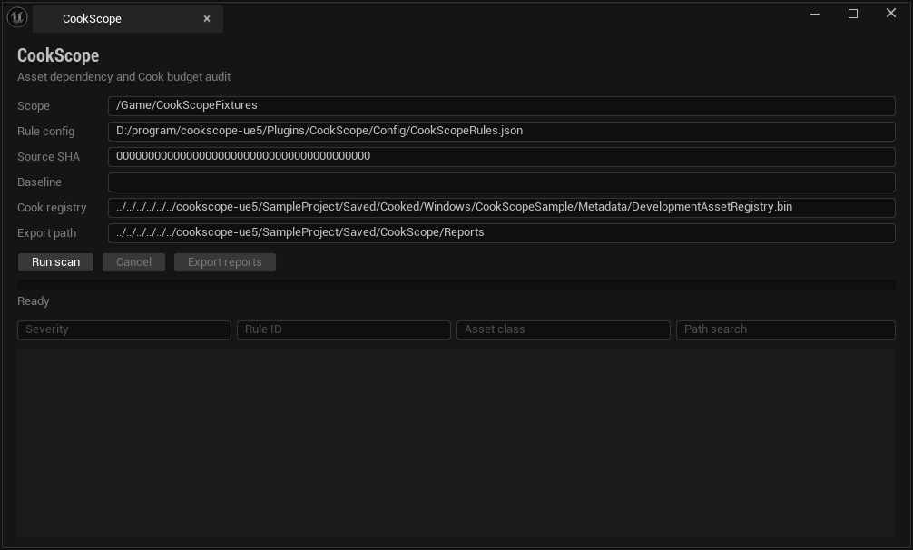
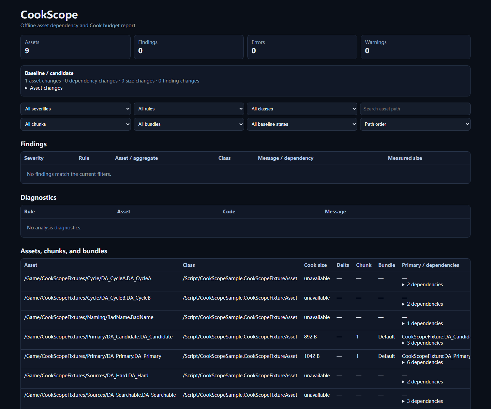

# CookScope

CookScope is a source-only Unreal Engine 5.8 Editor plugin, Commandlet, and sample project for deterministic Asset Registry dependency analysis and real Cook-budget enforcement.

> Released as source-only [`v0.1.0`](https://github.com/Iviesever/cookscope-ue5/releases/tag/v0.1.0) after the normal merge of [PR #1](https://github.com/Iviesever/cookscope-ue5/pull/1). Core, UE Automation, Commandlet, real Cook diff, reports, Editor UI, and plugin packaging were verified locally; the GitHub Release has no custom assets.

| Real UE 5.8 Editor tab | Real offline HTML report |
|---|---|
|  |  |

Shortest full audit command:

```powershell
UnrealEditor-Cmd.exe SampleProject/CookScopeSample.uproject -run=CookScopeAudit -config=Plugins/CookScope/Config/CookScopeRules.json -output=Artifacts/Reports -source-sha=<40-hex-sha>
```

The sample answers “why was this cooked?” with a typed chain such as `CookScopeFixture:DA_Primary → /Game/CookScopeFixtures/Targets/DA_Target` through Soft/Manage edges. Its controlled baseline `66256ac` and candidate `f204b3b` add exactly `/Game/CookScopeFixtures/Primary/DA_Candidate.DA_Candidate`, measured from separate real Development Asset Registries at **892 actual-cooked bytes**.

## Verified surface

| Area | Local evidence |
|---|---|
| Deterministic Core | 16 C++ contract executables plus a process-level CLI contract via MQB |
| UE integration | 7 Editor Automation tests over 20 deterministic `.uasset` fixtures |
| Commandlet | Clean/violation/invocation/internal/timeout exits `0/2/3/4/5` |
| Cook and diff | UE 5.8 Zen Cook metadata; 9 scoped assets, 3 actual-cooked, one 892-byte candidate addition |
| Reports | Canonical JSON, SARIF 2.1.0, JUnit XML, responsive self-contained HTML |
| Editor | Cancellable shared session, filters, finding/detail expansion, baseline comparison, why-cooked, locate/open, four-format export |

Run the main local checks:

```powershell
pwsh -File scripts/Test.ps1
pwsh -File scripts/Test-Unreal.ps1
pwsh -File scripts/Cook.ps1
pwsh -File scripts/Build-Plugin.ps1
```

## Architecture and boundaries

`CookScopeCore` owns strict schemas, graphs, rules, diffs, and report projection. UE adapters acquire Asset Registry/Asset Manager/Cook facts once; Slate, Data Validation, Commandlet, and CI consume the same Core results. Only `CookScopeCore` is present in non-Editor targets.

CookScope never labels package/source estimates as actual Cook size. `actual-cooked` exists only when loaded from a real UE Development Asset Registry. Missing measurements remain explicit diagnostics.

This repository intentionally excludes `Binaries`, `Intermediate`, `Saved`, cooked content, local reports, logs, archives, and packaged plugins. A future GitHub Release must contain source only and zero binary assets. See [known limitations](docs/KNOWN_LIMITATIONS.md) for the precise local/remote boundary.

AI assistance was used for implementation and documentation. Every shipped behavioral claim is tied to executable tests or real UE/browser output; see [AI assistance](docs/AI_ASSISTANCE.md).

## Documentation

- [Architecture](docs/ARCHITECTURE.md)
- [Asset Registry model](docs/ASSET_REGISTRY_MODEL.md)
- [Asset Manager and Primary Assets](docs/ASSET_MANAGER_AND_PRIMARY_ASSETS.md)
- [Cook pipeline](docs/COOK_PIPELINE.md)
- [Rule model](docs/RULE_MODEL.md)
- [Snapshot schema](docs/SNAPSHOT_SCHEMA.md) and [diff model](docs/DIFF_MODEL.md)
- [Report formats](docs/REPORT_FORMATS.md) and [Editor tooling](docs/EDITOR_TOOLING.md)
- [Commandlet and CI](docs/COMMANDLET_AND_CI.md), [build system](docs/BUILD_SYSTEM.md), and [testing](docs/TESTING.md)
- [Code walkthrough](docs/CODE_WALKTHROUGH.md), [interview guide](docs/INTERVIEW_GUIDE.md), and [live change drills](docs/LIVE_CHANGE_DRILLS.md)
- [Release notes](docs/RELEASE_NOTES_0.1.0.md)
